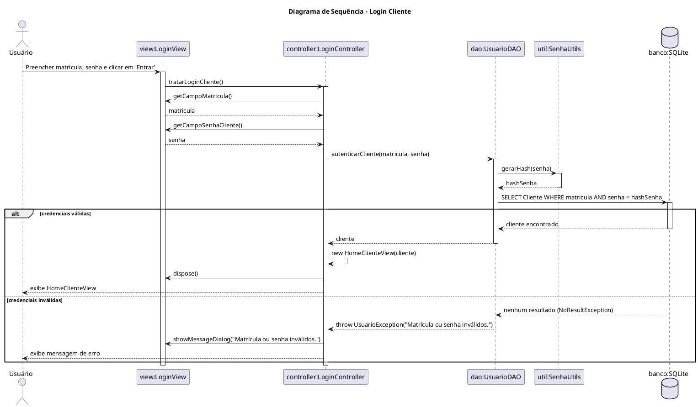
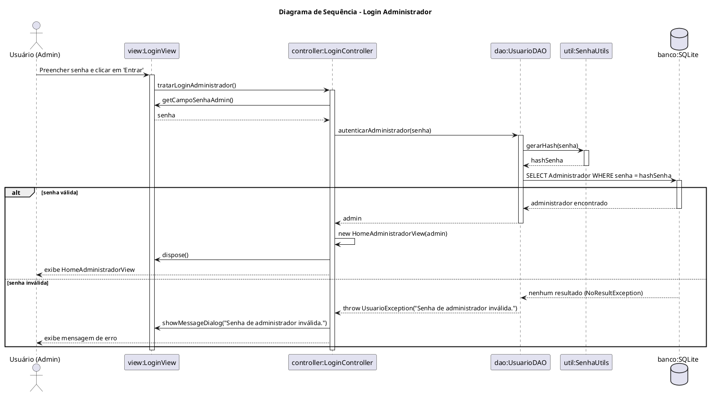

# Diagramas de Sequência

## Issue #21 - User Authentication and Initial Navigation
**Autor:** João Vitor Fogaça de Oliveira - @fajremvp

### 1. Login Cliente

Ver código fonte (PlantUML)

### 2. Login Administrador

Ver código fonte (PlantUML)

