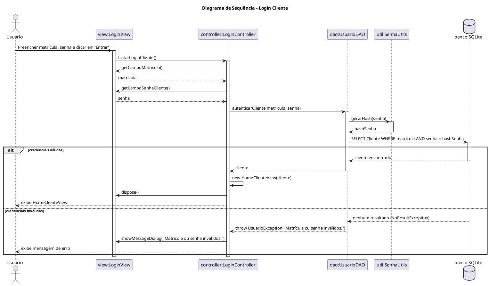
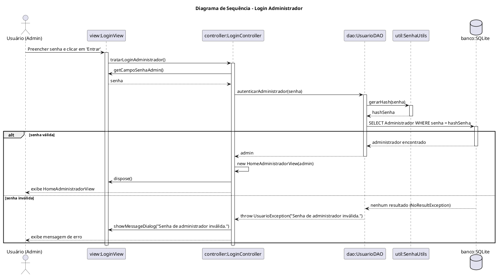
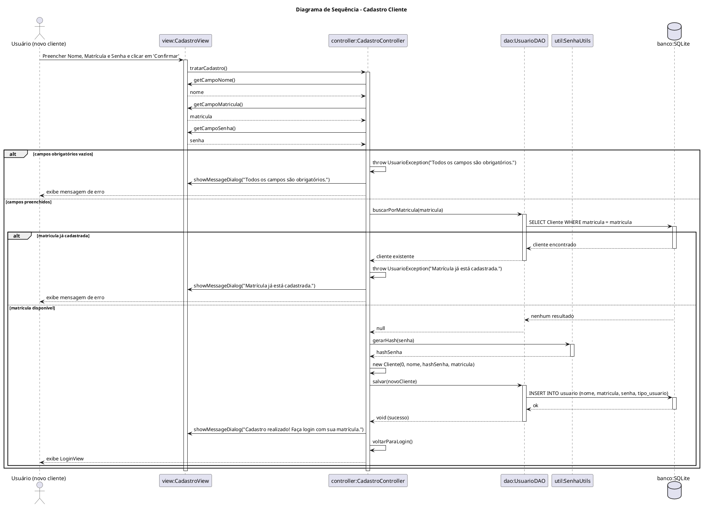
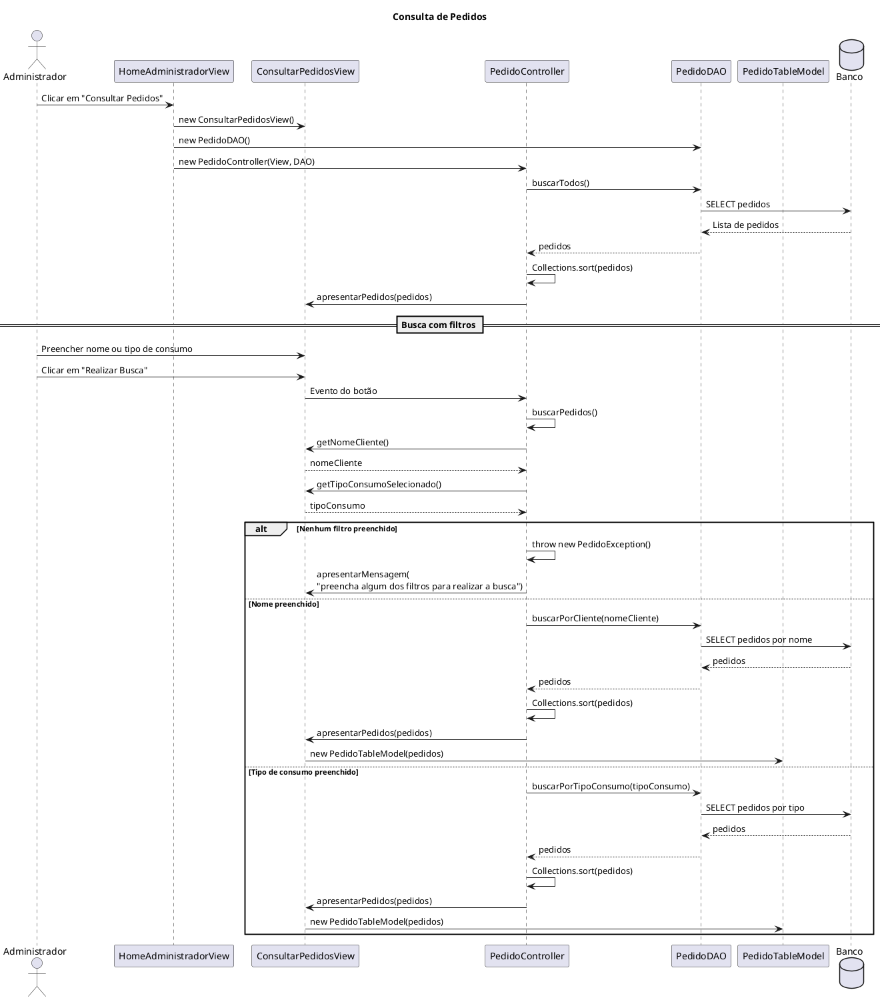
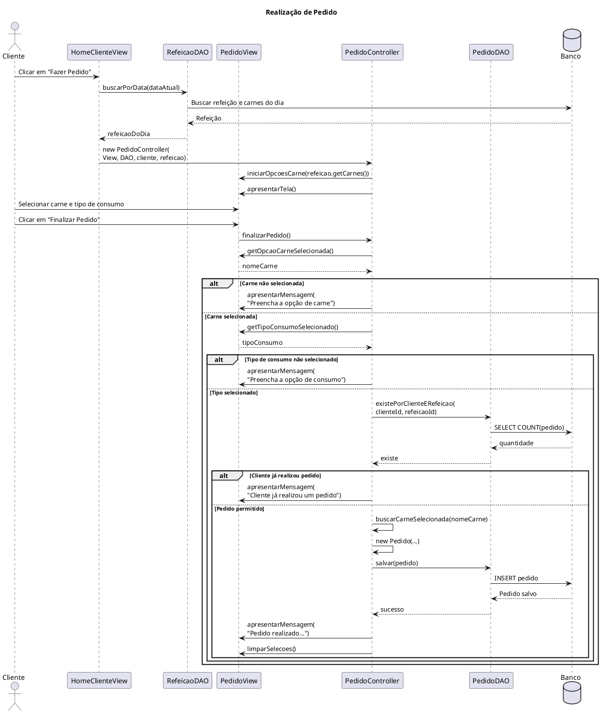
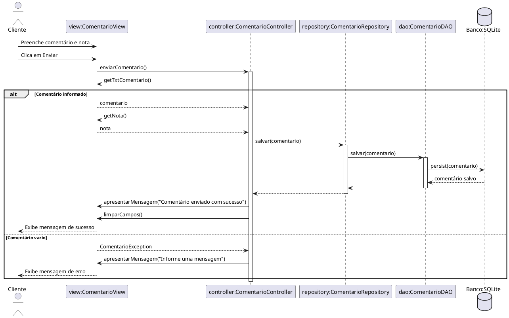
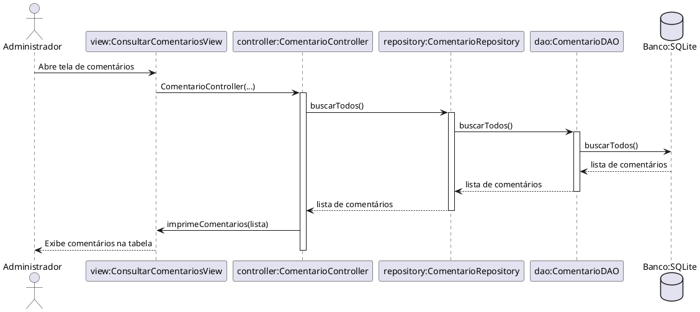
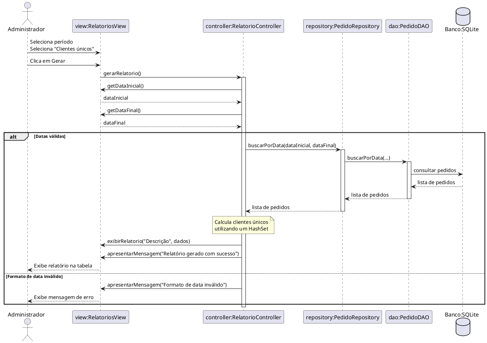

# Diagrama de Classes

# Diagramas de Sequência

## Issue #21 - User Authentication and Initial Navigation
**Autor:** João Vitor Fogaça de Oliveira - @fajremvp

### 1. Login Cliente

Ver código fonte (PlantUML)

### 2. Login Administrador

Ver código fonte (PlantUML)

## Issue #22 - Customer Registration and Profile Management
**Autor:** João Vitor Fogaça de Oliveira - @fajremvp

### 3. Cadastro Cliente
![Cadastro Cliente](https://www.plantuml.com/plantuml/png/dPRFRZet4CVlVeefbzyYaQhdbLgb4AfKofyqaFPO3TufkFNQrFP2bBU9UgXKAQS-mhvORI-xPXE2A8TaRVETZ-VFpCAbTMXSLKgOO87M6JsHWfGZveIJ15S2bmPBX89WHdzMzJ-A2uIBJWwjdY5tsi2JhT083MXXuDVrQzXaIcyqy4Ov7B0r6YUuMADoCDW8skOjxcU_6GJZiEZhk5PU82MPJZtfZg9DslOj2zJvpg-hx--Zr3_xcie9cSz8hV39hsmKnIqhqE42BS5WWOhhVFRJZN3KKCQCjG5VV1Tzpk7142c-8WDtkgGHtA8pzHkl908rIA2G2uu6g8GltklVX2dHV0af51jqr4JFml_0JN7bu0mwD6q2ic6osOkUfNNoQqbkWkLQ1w-yNGD_HrUwfAF68HWHOlcCKBQ2evYOXiyGDgQTeNJ0WzY2NXYnH5V_QuJVRV35FnW0x9bzoDFAw6tRZTDdJcidjCe6Srq4e6tHjlvBz_bV3uQHVSX_kzBRMx8Mb-GdG-hbkK1FtFcM0psB1K59Ac3BC6baZ6QCfAMMkcwQIXI70W_TdCEYiXpDWpQfHbqn6WVQLWdwUE2VqNoSmsnwCvtCssc6NwwdZzDKJFWshT-Xngmva0xArEc_rw_0coR5eZ695uxXelMNxwuY5ISR2zt92jhdjwVHstwP4-HPM1TMVKOADvwVrpAt_R38kbvmRNbFxvbJYMSqJRIBZRDNZ4BOjLRrsuRamKeeKgkg14EsakwyEgXAol-P-lWE2Ay4W-OQxIgBSvyYxnXHs1t7tOVxLnxGrnNK1vpI0OgsxGHatupYst2Kq2D8y_GPBURJejoWYLzwErelgluClfl37-zcqyUvVypleMgA3Lbq9Dq-0jluuyHQ_xfJ7RfYVB3S-eyp2hpHee3CLfoirSFJItry4BfV4OPGYXSiz5Vm0zP_8_YFXGAkIx0LfcO-CcrzRwL3yu06Rm8dEtMUeZfu6_Ma2XR-s5wKoNx_D9gmIo-kIlaV)

Ver código fonte (PlantUML)

## Issue #20 - Menu and Meat Option Management (Admin)
**Autor:** Gustavo Hoffmann - @GustavoHoffmann3

### 4. Cadastrar Refeição

### 5. Cadastrar Opção de Carne

## Issue #23 - Point of Sale - Place an Order (Customer)
**Autor:** Maria Zortea - @maria-zortea

### 6. Realizar Pedido

Ver código fonte (PlantUML)

## Issue #24 - Kitchen Dashboard (Admin)
**Autor:** Maria Zortea - @maria-zortea

### 7. Consultar Pedidos

Ver código fonte (PlantUML)

## Issue #25 - Customer Feedback
**Autor:** Ruan Kestring - @RuanKestring

### 8. Realizar Comentário

Ver código fonte (PlantUML)

## Issue #26 - Comments Review (Admin)
**Autor:** Ruan Kestring - @RuanKestring

### 9. Consultar Comentários

Ver código fonte (PlantUML)

## Issue #27 - Reports Dashboard (Admin)
**Autor:** Ruan Kestring - @RuanKestring

### 10. Gerar Relatório de Clientes Únicos

Ver código fonte (PlantUML)

